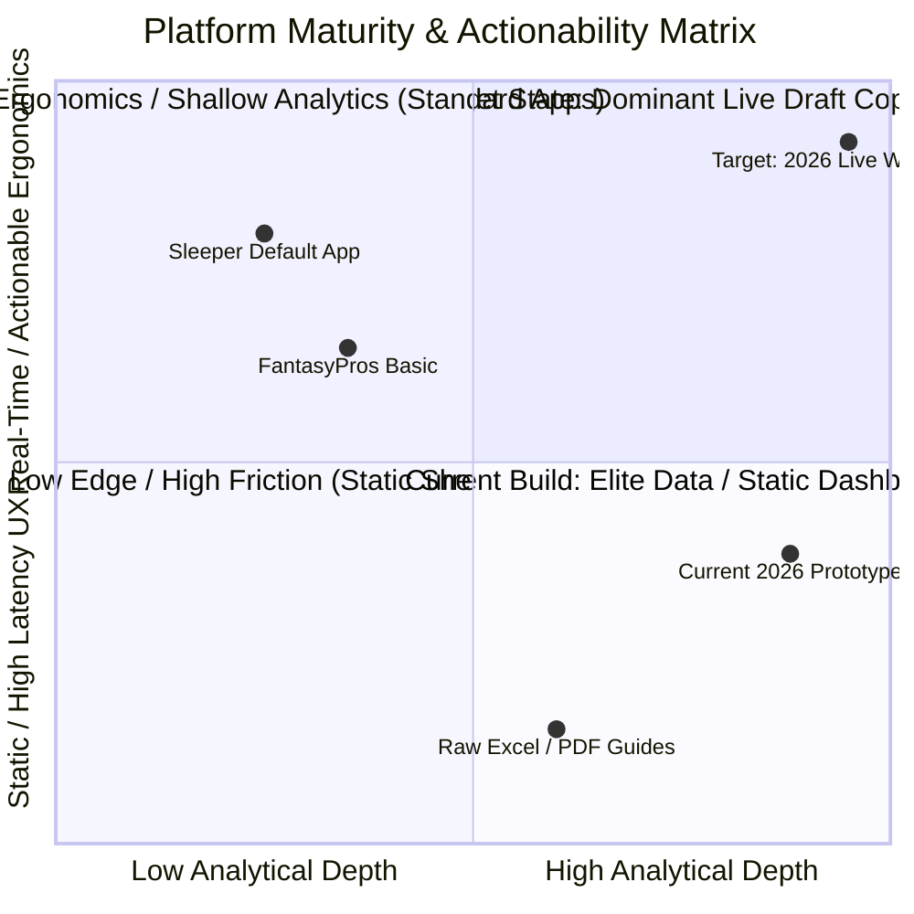

# 🏈 Product & UX Evaluation: 2026 Fantasy Football Draft Intelligence Engine

**Author / Role:** Principal Product Manager & Sports Analytics Architect  
**Document Version:** 2.1 (Live Draft Copilot Specification)  
**Status:** Approved for Implementation (P0 War Room Sprint)  

---

## 1. Executive Scorecard & Product Health



### 🌟 Strengths
1. **Multi-Source Signal Blending & Entity Normalization**: Resolving seven disparate industry datasets (Smyth regression models, Duracell scheme matrices, JoScho athletic/hurdle metrics, and FantasyPoints volume) via a strict two-stage canonical normalizer eliminates the manual cross-referencing friction that typically degrades live draft decision-making.
2. **Methodologically Sound GMM Tiering**: Implementing 1D Gaussian Mixture Modeling via Expectation-Maximization isolates statistically valid tier breaks in market consensus data rather than relying on arbitrary expert cutoffs. Centering overall whiskers on overall consensus rank resolves the coordinate contamination that plagues amateur draft tools.
3. **High-Salience Strategic Taxonomy**: Compressing complex, multi-variable projections into clear categorical taxonomies (💥 *Exodia*, 👑 *Hero*, 🎯 *Smyth Target*, 💰 *Contract Year*, 🚫 *Avoid*) provides high-contrast visual anchors that accelerate triage under time pressure.

### ⚠️ Critical Vulnerabilities
1. **Static Replacement Baseline (The Flat-VORP Trap)**: The VORP engine relies on static cutoffs ($k=12$ for QB, $k=24$ for RB, $k=36$ for WR) calculated against a static pre-draft distribution. In live drafts, positional runs distort baseline value. Failing to update baselines dynamically as the draft pool drains leads to severe misvaluations during mid-to-late round positional runs.
2. **Streamlit Rerun Latency & Interaction Friction**: Streamlit’s native execution model reruns the entire Python script on every widget interaction. In a live draft with a 60-second clock, full-page reruns, widget latency, and vertical scrolling across eight separate tabs cause fatal decision latency and cognitive overload.
3. **Absence of Live State Tracking & Contextual Roster Construction**: The application operates as an analytical dashboard rather than an active draft copilot. Without 1-click draft state tracking, queue sniping alerts, survival probability modeling to the user's next pick, and dynamic roster-fill constraints (e.g., flex weighting, QB/TE scarcity, correlation stacking), the user must perform substantial mental math.

---

## 2. Module-by-Module Tactical Critique

### Tab 1: 🏆 Master Consensus Board
* **Current State Assessment**: Serves as the primary data grid (512 rows, 70+ columns) with filtering by round, tier, strategic badges, and avoid status.
* **UX/UI Friction Points**: Severe information overload. Displaying dozens of data columns forces horizontal scrolling across the screen. There is no inline mechanism to mark players as "Drafted by Me" vs. "Drafted by Opponent," forcing users to cross-reference their draft platform manually.
* **High-Impact Enhancements**:
  * **Dual-View Architecture**: Introduce a *Live HUD Mode* (constrained to 6 essential columns: Name/Team/Bye, Pos Tier, Dynamic VORP, Platform Delta, Tactical Badge, Action Button) alongside the full *Scouting Deep-Dive Mode*.
  * **Instant Row State Mutators**: Implement 1-click inline actions (*Drafted*, *Mine*, *Target/Star*) backed by `st.session_state` that immediately grey out or remove players without a heavy layout shift.

### Tab 2: 📊 Boris Chen GMM Staircase Charts
* **Current State Assessment**: Plotly scatter and error-bar visualizations rendered across Overall Top 100, RB, WR, QB, and TE views with monotonic tier color assignments.
* **UX/UI Friction Points**: Plotly charts are computationally heavy to redraw on Streamlit state changes. Whiskers become visually cluttered once 40+ players are off the board, and finding who is still available requires hovering across dozens of individual data points.
* **High-Impact Enhancements**:
  * **Dynamic Tier Depletion**: Automatically strike through or dim drafted players on the GMM plot while recalculating active tier boundaries in real time.
  * **Tier Cliff Alerts**: Add a summary banner atop the chart:
    $$\text{Tier Cliff Metric} = \text{Avg}(\text{VORP}_{\text{Tier } k}) - \text{Avg}(\text{VORP}_{\text{Tier } k+1})$$
    Trigger visual warnings when only 1–2 players remain in an active tier (e.g., *"⚠️ Tier 2 WR Cliff: 14.8 pt drop to Tier 3 remaining"*).

### Tab 3: 🎯 Pick 1.05 Playbook
* **Current State Assessment**: Hardcoded scenario tree and strategic execution branches tailored specifically to draft slot 1.05.
* **UX/UI Friction Points**: Highly rigid. The module becomes obsolete if the user drafts from any other draft slot or if early-round chaos disrupts expected board falloff.
* **High-Impact Enhancements**:
  * **Dynamic Draft Slot Engine**: Convert from a static 1.05 view into a parameterized Draft Position Engine (Draft Slot 1–12, League Size 8–16, Snake vs. 3rd-Round Reversal).
  * **Monte Carlo Contingency Trees**: Simulate the probability of target availability at the user’s upcoming 2–3 picks based on historical platform ADP standard deviations.

### Tab 4: ⚡ ADP Arbitrage & Steals
* **Current State Assessment**: Cross-platform comparison matrix highlighting price differentials ($\Delta > \pm 12.0$) across Yahoo, ESPN, Sleeper, and CBS against the composite rank.
* **UX/UI Friction Points**: Displaying all four platforms at once creates unnecessary visual noise during live execution; managers only draft in one client at a time.
* **High-Impact Enhancements**:
  * **Draft Room Target Filter**: Provide a single platform selector (e.g., `Platform: Sleeper`) that isolates only the platform-specific delta ($\Delta_{\text{ADP}, P}$).
  * **Survival Probability ($P_{\text{avail}}$)**: Model the likelihood that a targeted value player reaches the user's next turn:
    $$P_{\text{avail}}(i, \text{Next Pick}) = 1 - \Phi\left(\frac{\text{Next Pick} - \text{ADP}_i}{\sigma_{\text{ADP}, i}}\right)$$

### Tab 5: 🏟️ Team Schemes & Environments
* **Current State Assessment**: Aggregated 32-team table tracking OL grades, PROE, 2-WR vs. 3-WR set frequencies, and playcaller tendencies.
* **UX/UI Friction Points**: Disconnected from player-level evaluation. A user evaluating an RB in Tab 1 must switch tabs to inspect offensive line rank or playcaller run rates.
* **High-Impact Enhancements**:
  * **Contextual Micro-Chips**: Inject scheme flags directly into the Master Board and Live HUD as compact tags (e.g., `[OL: #2]`, `[PROE: +7.2%]`, `[Pace: Top 3]`).
  * **Week 15–17 Playoff Correlation Matrix**: Highlight correlated game environments and soft defensive matchups for championship weeks.

### Tab 6: 🎓 Rookie Board & Profiler
* **Current State Assessment**: JoScho combine metrics, college dominator ratings, and ML hurdle hit probabilities for 80 incoming rookies.
* **UX/UI Friction Points**: Siloing rookies into an isolated tab obscures direct comparisons against mid-to-late round veterans competing for similar depth-chart roles.
* **High-Impact Enhancements**:
  * **Unified Ceiling/Floor Overlay**: Integrate the JoScho Rookie Hit Probability directly into the primary player cards as an upside volatility multiplier.
  * **Redraft vs. Dynasty Switcher**: Enable one-click toggling between Year-1 immediate volume projections and multi-year dynasty valuations.

### Tab 7: ⚙️ Custom Scoring Engine
* **Current State Assessment**: Dynamic recalculation interface adjusting baseline VORP across user-configured scoring rules (PPR, Passing TD values, League Size).
* **UX/UI Friction Points**: Parameter adjustments trigger full-app script re-runs and recalculations, introducing UI latency. Lacks presets for high-growth formats (Superflex, TE-Premium).
* **High-Impact Enhancements**:
  * **Vectorized In-Memory Recalculations**: Utilize vectorized Polars/NumPy operations to recalculate VORP and composite ranks in under 15 milliseconds.
  * **Format Presets**: Provide instant configuration buttons for Superflex (2QB), TE-Premium (1.5 / 2.0 PPR), and Point-Per-First-Down (PPFD) formats.

### Tab 8: 🔄 Pipeline Sync & Settings
* **Current State Assessment**: Administrative interface for triggering data refreshes, executing Google Sheets sync, and checking pipeline health.
* **UX/UI Friction Points**: Exposes engineering/pipeline plumbing in the primary user navigation bar, cluttering the live drafting experience.
* **High-Impact Enhancements**:
  * **Background Async Workers**: Move ingestion routines to scheduled background tasks (e.g., GitHub Actions / Celery), removing manual sync elements from the live navigation bar.
  * **Draft State Session Management**: Replace manual database sync controls with Import/Export Draft Session State (JSON) to enable state persistence across browser refreshes.

---

## 3. Live Draft "War Room" Feature Spec

```
+----------------------------------------------------------------------------------------------------+
|  WAR ROOM HUD: PICK 3.05 (ON THE CLOCK: 00:43)                          LEAGUE: 12-TEAM HALF-PPR   |
+------------------------------------+----------------------------------+----------------------------+
|  MY ROSTER (STARTERS & BENCH)      |  OPTIMAL RECOMMENDATIONS         |  QUEUE & SNIPER RADAR      |
|  QB: [Empty]                       |  1. 👑 J. Taylor (RB) - VORP: 42 |  1. 🎯 T. McBride (TE)     |
|  RB: 💥 B. Robinson (Tier 1)       |     *Tier 2 Cliff: Last RB left  |     *Snip Risk: 88% (HIGH) |
|  WR: 👑 P. Nacua (Tier 2)          |  2. 🎯 D. Smith (WR) - VORP: 38  |  2. ⭐ K. Walker (RB)      |
|  WR: [Empty]                       |     *P(Avail next turn): 12%     |     *Snip Risk: 34% (LOW)  |
|  TE: [Empty]                       |  3. 💥 J. Allen (QB) - VORP: 45  |----------------------------|
|  FLEX: [Empty]                     |     *Positional Scarcity +Stack  |  QUICK SEARCH / DRAFT:     |
+------------------------------------+----------------------------------+  [ Filter Player...     ]  |
|  ACTIVE POSITIONAL TIERS           |  DRAFTED IN ROOM (LAST 3 PICKS)  |  [ DRAFT SELECTED ] (Enter)|
|  RB: [T1: 0] [T2: 1] [T3: 6]       |  * 3.02: D. London (WR)          |                            |
|  WR: [T1: 0] [T2: 2] [T3: 8]       |  * 3.03: M. Harrison Jr. (WR)    |  KEYBOARD SHORTCUTS:       |
|  TE: [T1: 0] [T2: 2] [T3: 3]       |  * 3.04: C. Olave (WR)           |  [1-3] Draft Pick Rec      |
|  QB: [T1: 2] [T2: 3] [T3: 5]       |  *(Positional Run: WR 3x)*       |  [Space] Draft Top Queue   |
+------------------------------------+----------------------------------+----------------------------+
```

### 3.1 Dynamic Roster Needs Engine & Real-Time Replacement Shifts
Static VORP uses a fixed baseline $k$. In the Live Draft Execution Engine, replacement levels shift dynamically based on actual positional depletion:

$$\text{Active Baseline Cutoff: } k_{\text{pos}}(t) = \text{Total Starters}_{\text{pos}} - \sum_{j \in \text{Drafted}} \mathbb{I}(\text{pos}_j = \text{pos}) + \text{Waiver Buffer}_{\text{pos}}$$

As opponents draft a position heavily, $k_{\text{pos}}(t)$ drops deeper into the player pool, depressing the baseline points and instantly boosting the relative dynamic VORP ($\text{DynVORP}$) of remaining starters at that position.

#### Marginal Roster Utility (MRU) Formulation
To prevent drafting bench players over critical starting needs, candidate players are scored via Marginal Roster Utility:

$$\text{MRU}_i = \text{DynVORP}_i \times W_{\text{Roster}}(\text{pos}_i) \times \text{CliffWeight}(\text{Tier}_i) \times \text{StackBonus}_i$$

Where:
* $W_{\text{Roster}}(\text{pos}_i)$: Exponential decay weight based on filled roster slots:
  * Open Starter Slot: $1.0$
  * Open Flex Slot: $0.85$
  * Primary Bench Slot: $0.45$
  * Secondary / Redundant Bench Slot: $0.15$
* $\text{CliffWeight}(\text{Tier}_i) = 1.0 + \left(0.20 \times \frac{1}{\text{Remaining Players in Tier}_i}\right)$
* $\text{StackBonus}_i = 1.08$ if player correlates with an already drafted elite QB (Weeks 15–17 correlation).

### 3.2 Recommendation Engine
When the user is on the clock, the War Room presents three distinct choices to avoid decision paralysis:

```
+----------------------------------------------------------------------------------------------------+
| OPTIMAL RECOMMENDATION CARDS (CHOOSE STRATEGY)                                                     |
+----------------------------------+----------------------------------+------------------------------+
| 🛡️ BEST VALUE AVAILABLE          | ⚡ TIER CLIFF SAFEGUARD          | 🚀 MAXIMUM CEILING PLAY      |
| Jonathan Taylor (RB - IND)       | Trey McBride (TE - ARI)          | Josh Allen (QB - BUF)        |
| DynVORP: +42.1 | Tier: 2 (RB4)   | DynVORP: +31.4 | Tier: 2 (TE2)   | DynVORP: +45.8 | Tier: 1 (QB1) |
| Why: 4.8 pts ahead of consensus  | Why: Last TE before 18 pt drop;  | Why: JoScho Talent 98/100;   |
| board value; elite OL rank (#3). | 94% chance gone before pick 4.08 | #1 overall weekly upside.    |
| [ Draft (Key: 1) ]               | [ Draft (Key: 2) ]               | [ Draft (Key: 3) ]           |
+----------------------------------+----------------------------------+------------------------------+
```

### 3.3 Draft Queue Sniping & 1-Click State Tracking
* **Real-Time Snip Probability Engine**: Calculates the probability that queued targets are taken prior to the user's next pick based on the roster needs and historical draft tendencies of intervening drafters.
* **Streamlit State Optimization**: Replaces default full-page widget bindings with custom HTML/JavaScript keybind listeners (`st_keyup` / component wrappers) mapped to `[1]`, `[2]`, `[3]`, and `[Space]`. Drafting mutates the in-memory array instantly with zero script recalculation delay.

---

## 4. Prioritized Product Roadmap (P0 / P1 / P2 Matrix)

| Priority | Feature Name & Description | User Value / Competitive Advantage | Technical Complexity |
| :--- | :--- | :--- | :---: |
| **P0** | **Dedicated Live Draft "War Room" HUD**<br>Single-screen interface with 3-recommendation cards, live roster tracking, and keyboard-driven draft entry. | Eliminates tab-switching and decision fatigue within the 60-second pick window. | **Medium** |
| **P0** | **Dynamic VORP & Tier-Depletion Engine**<br>Vectorized recalculation of replacement levels and tier-cliff weights as players are drafted. | Prevents drafting from outdated baselines during aggressive positional runs. | **Medium** |
| **P0** | **Platform-Specific Pick Survival Odds ($P_{\text{avail}}$)**<br>Real-time calculation of whether a player will survive until the user's next pick. | Informs optimal draft timing: pick the high-snip-risk player now, take the falling value later. | **Low** |
| **P1** | **Live Draft Sync (Sleeper / Yahoo WebSockets)**<br>Automated synchronization with live draft room state via official APIs or a lightweight Chrome extension. | Eliminates manual click tracking entirely, providing a hands-free copilot experience. | **High** |
| **P1** | **Dynamic Auction / Salary Cap Draft Engine**<br>Real-time max-bid calculator, dynamic inflation tracking, and surplus value optimizer. | Expands TAM to high-stakes auction leagues with real-time dollar adjustments. | **High** |
| **P1** | **Correlation & Stacking Optimizer**<br>Automated detection of QB-WR/TE stacks and Week 15–17 game correlations with visual synergy badges. | Provides an analytical edge in high-stakes formats and best-ball tournaments. | **Medium** |
| **P1** | **Format Presets (Superflex, TE-Premium, PPFD)**<br>Instant roster slot matrix reconfiguration with custom baseline shifts for 2QB and TEP formats. | Delivers immediate model accuracy for non-standard league formats without manual slider tuning. | **Low** |
| **P2** | **Post-Draft Roster Evaluation & Trade Hub Sync**<br>League roster grading, projected weekly point distribution, and automated trade target identification. | Extends platform retention from a draft-day tool into an in-season management suite. | **Medium** |
| **P2** | **Real-Time Social & News Steam Webhook**<br>Automated Twitter/Reddit sentiment monitoring that flags breaking training camp injuries and depth chart shifts. | Instant injury notification during drafts before platform ADP adjusts. | **Medium** |
