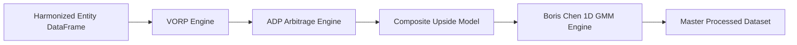

# 🏈 System Architecture & Product Design Document
## Fantasy Football Draft Kit & Scouting Intelligence Engine 2026
**Document Version:** 2.0  
**Target Audience:** Product Management, Lead Engineers, Data Science & Analytics Stakeholders  
**Status:** Approved & Implemented in Production (`main` / Streamlit Cloud)  

---

## 1. Executive Summary & Product Vision

### 1.1 Problem Statement
In competitive 12-team fantasy football drafts (Half-PPR / PPR), fantasy managers face information fragmentation:
1. **Siloed Expert Sources**: Different platforms offer isolated viewpoints—FantasyPros provides Consensus Rankings (ECR), Joel Smyth's Draft Guide offers deep film and regression metrics, Duracell provides team scheme and contract-year tracking, JoScho delivers per-play opportunity-adjusted talent scores and rookie combine models, and FantasyPoints/Footballguys deliver raw volume projections.
2. **Platform Pricing Inefficiencies**: Drafting platforms (Yahoo, ESPN, Sleeper, CBS) exhibit extreme Average Draft Position (ADP) lag compared to true market value.
3. **Flawed Ranking Visualizations**: Positional tiering and consensus high/low rank spreads are frequently corrupted when mixing overall and positional consensus data, leading to distorted uncertainty intervals.
4. **Draft-Day Execution Friction**: Fantasy managers require immediate, actionable visual cues (custom emojis, tactical cheat sheets, zero-latency filters) rather than static spreadsheets.

### 1.2 Solution Overview
The **Fantasy Football Draft Kit & Scouting Intelligence Engine 2026** is an automated, end-to-end analytics platform that ingests, cleans, harmonizes, and statistically models data from 7 disparate industry authorities into a unified master database. It delivers:
* **Value Over Replacement Player (VORP)** calculated dynamically against a 12-team starting roster baseline.
* **Gaussian Mixture Model (GMM) 1D Tiering** inspired by Boris Chen, separating continuous consensus data into discrete, statistically significant tiers with high/low uncertainty whiskers.
* **Master Surgical Taxonomies** that assign clear strategic classifications (💥 Exodia, 🎯 Target, 👑 Hero, ⭐ Value, 💰 Contract, 🔥 Catalyst, ⚠️ Avoid / 🚫 Fade).
* **Multi-Format Export Pipelines** producing SQLite databases, Master CSVs, Google Sheets payloads, and single-click FantasyPros copy-paste cheat sheets.
* **Cloud-Native Interactive Dashboard** deployed via Streamlit Community Cloud.

```mermaid
graph TD
    subgraph Ingestion["1. Multi-Source Ingestion Engine"]
        FP[FantasyPros Consensus API / Web]
        SMYTH[Joel Smyth 2026 PDF Guide]
        DUR[Duracell Tiers & Scheme CSV]
        JOSCHO[JoScho Talent Scores & ML Rookies]
        FP_PROJ[FantasyPoints Official Projections]
        FBG[Footballguys Custom Scoring]
        REDDIT[Reddit /r/fantasyfootball PRAW Steam]
    end

    subgraph Normalization["2. Entity Resolution & Harmonization"]
        NORM[DataNormalizer: Name Normalization, Suffix Stripping, Team Aliases]
    end

    subgraph Modeling["3. Statistical Analytics & Feature Engineering"]
        VORP[VORP Baseline Engine: 12-Team Half-PPR Cutoffs]
        ARB[ADP Arbitrage Engine: Yahoo / ESPN / Sleeper Deltas]
        COMP[Composite Upside Model: 0-100 Score & Badges]
        GMM[Boris Chen 1D GMM Engine: Monotonic Clustering]
    end

    subgraph Storage["4. Master Data Stores & Export Pipeline"]
        CSV[master_draft_kit_2026.csv - 512 Rows]
        PARQ[master_processed.parquet]
        SQL[draft_kit_2026.db - SQLite]
        FP_TXT[fantasypros_paste_with_notes.txt]
        GSYNC[Google Sheets Cloud Sync]
    end

    subgraph Presentation["5. Presentation & UI Layer"]
        ST_APP[Streamlit Web App: 8 Interactive Modules]
        ST_BOARD[Master Board: Dynamic Avoid/Focus Filters]
        ST_GMM[Boris Chen Interactive Staircase Charts]
        ST_STRAT[Pick 1.05 Playbook & Draft Strategy]
    end

    Ingestion --> Normalization
    Normalization --> Modeling
    Modeling --> Storage
    Storage --> Presentation
```



---

## 2. Multi-Source Data Ingestion Architecture

The ingestion subsystem extracts structured, semi-structured, and unstructured data across 7 independent providers, resilient to network rate limits and schema variances.

| Provider / Source | Ingestion Mechanism | Extracted Schema / Key Features | Primary Value Added |
| :--- | :--- | :--- | :--- |
| **FantasyPros** | REST API / Scraper with Exponential Backoff | `clean_name`, `position`, `team`, `ecr`, `best_rank`, `worst_rank`, `std_dev`, `pos_ecr`, `adp_consensus`, `adp_espn`, `adp_yahoo`, `adp_sleeper`, `adp_cbs` | Baseline market consensus rankings and cross-platform ADPs |
| **Joel Smyth 2026 Draft Guide** | PyPDF / Regex Tabular Parser | `smyth_ecr`, `smyth_color_tag` (Green/Yellow/Red), `raw_ppg_25`, `adj_ppg_25`, `luck_pct_lost`, `luck_pct_gained`, `smyth_gold_mine`, `ol_2026_score`, `playcaller_fantasy_rank`, `pace_2025` | Film-backed regressions, luck delta metrics, OL cohesion, playcaller pass/run tendencies |
| **Duracell 2026 Guide & Matrix** | Structured CSV / Ingestion Parser | `duracell_tier`, `risk_rating`, `volatility_index`, `is_contract_year`, `duracell_ol_rank`, `two_wr_set_pct`, `three_plus_wr_set_pct`, `duracell_proe`, `rb_playoff_toughness`, `wr_shadow_cb_count` | Scheme alignment (PROE, 2-WR vs 3-WR), contract-year incentives, strength of schedule |
| **JoScho Analytics Hub** | CSV / Excel Data Pipeline | `nfl_talent_score`, `college_talent_score`, Per-Play Z-scores (`z_avg_separation`, `z_yprr`, `z_MTF_rush`, `z_explosive_rush_rate`, `z_cpoe`), `rookie_hit_prob`, `rookie_speed_score` | Play-by-play opportunity-adjusted talent scores (0–100) and ML hurdle rookie hit probability |
| **FantasyPoints (John Hansen)** | CSV Pipeline | `fantasypoints_proj_pts`, `auction_value`, `hansen_top200_rank` | High-accuracy volume projections and auction values |
| **Footballguys** | CSV Pipeline | `fbg_proj_pts`, `fbg_rank`, `fbg_tier` | Custom scoring consensus and secondary projection blending |
| **Reddit /r/fantasyfootball** | PRAW Reddit API Client | `reddit_mentions_7d`, `sentiment_polarity`, `steam_index`, `steam_trend` | Real-time social steam, sentiment spikes, and injury buzz |

---

## 3. Entity Resolution & Data Harmonization

Because each data source represents player names and team designations differently, the system implements a strict two-stage normalizer (`src/analytics/normalizer.py`):

### 3.1 Player Name Normalization Algorithm
1. **Case & Whitespace Normalization**: Lowercase conversion, trimming leading/trailing whitespace, and reducing internal whitespace.
2. **Punctuation & Diacritic Stripping**: Removal of apostrophes, hyphens, periods, and accent marks (e.g., `Ja'Marr Chase` $\rightarrow$ `jamarr chase`, `Amon-Ra St. Brown` $\rightarrow$ `amon ra st brown`).
3. **Generational Suffix Stripping**: Regex removal of suffixes (`Jr.`, `Sr.`, `II`, `III`, `IV`, `V`) to avoid cross-table mismatches (e.g., `James Cook III` matches `James Cook`).
4. **Canonical Alias Dictionary**: Hardcoded override mapping for known player nicknames, transliterations, and legal name variances (e.g., `Kenneth Walker III` $\rightarrow$ `kenneth walker`, `Marquise Brown` $\leftrightarrow$ `hollywood brown`).

### 3.2 Team Code Reconciliation
Maps legacy or divergent team abbreviations to standard 3-letter NFL codes:
$$\text{JAC} \rightarrow \text{JAX}, \quad \text{WSH} \rightarrow \text{WAS}, \quad \text{LA} \rightarrow \text{LAR}, \quad \text{SAN} \rightarrow \text{LAC}$$

---

## 4. Statistical Modeling & Feature Engineering Pipeline

Once data is harmonized, it passes sequentially through four core analytical engines:



### 4.1 Value Over Replacement Player (VORP) Engine
VORP quantifies how many fantasy points a player is projected to score above a baseline player readily available on the waiver wire or late in a 12-team draft:

$$\text{VORP}_i = \text{Projected Points}_i - \text{Baseline Points}_{\text{Position}(i)}$$

#### 12-Team Half-PPR Replacement Baseline Cutoffs:
* **Quarterback (QB)**: 12th ranked QB ($k = 12$) $\rightarrow$ Baseline: **272.9 pts**
* **Running Back (RB)**: 24th ranked RB ($k = 24$) $\rightarrow$ Baseline: **181.3 pts**
* **Wide Receiver (WR)**: 36th ranked WR ($k = 36$) $\rightarrow$ Baseline: **158.5 pts**
* **Tight End (TE)**: 12th ranked TE ($k = 12$) $\rightarrow$ Baseline: **124.0 pts**
* **Kicker (K)**: 12th ranked K ($k = 12$) $\rightarrow$ Baseline: **130.0 pts**
* **Defense / Special Teams (DST)**: 12th ranked DST ($k = 12$) $\rightarrow$ Baseline: **95.8 pts**

### 4.2 Platform ADP Arbitrage Engine
Draft platforms exhibit distinct structural biases. The Arbitrage Engine computes the market delta for each platform $P \in \{\text{Yahoo}, \text{ESPN}, \text{Sleeper}, \text{CBS}\}$:

$$\Delta_{\text{ADP}, P} = \text{ADP}_P - \text{Model Composite Rank}$$

* **$\Delta > +12.0$**: **Massive Draft Day Steal** (Player drafted much later on that platform).
* **$\Delta < -12.0$**: **Overdraft Trap** (Platform's default rankings force an early reach).

### 4.3 Composite Upside & Taxonomy Engine
To generate a single predictive rank, the engine blends multi-dimensional factors into a composite 0–100 score:

$$\text{Composite Score} = w_1 \cdot \text{Normalized VORP} + w_2 \cdot \text{Talent Score} + w_3 \cdot \text{Scheme Score} + w_4 \cdot \text{Luck Regression} + \text{Incentive Multipliers}$$

#### Strategic Badges & Designation Taxonomies:
* 💥 **Exodia Core**: Non-negotiable structural anchors (Gibbs, Bijan, Taylor, Puka, Chase).
* 👑 **Hero / Guru 12**: High-floor, elite volume cornerstones.
* 🎯 **Joel Smyth Green Target**: Regression models indicate significant positive point regression (+12 smyth tag).
* 💰 **Contract Year Asset**: Players entering contract years with heightened historical touch volume.
* 🔥 **Breakout Catalyst**: Verified structural catalyst (e.g. vacated targets $>15\%$, top offensive environment).
* ⭐ **Top 10 Offense Undervalued Asset**: Most discounted player attached to top-10 scoring offenses.
* 🚫 **Red Fade / ⚠️ Avoid**: Extreme overvaluation, low PROE trap, age-30 cliff, or severe regression risk (e.g. Achane, McBride, Etienne, Burrow).

### 4.4 Boris Chen Gaussian Mixture Model (GMM) Tiering Engine
The engine uses an Expectation-Maximization (EM) 1D Gaussian Mixture clustering model to identify natural tier breaks in expert consensus data:

$$p(x) = \sum_{k=1}^{K} \pi_k \mathcal{N}(x \mid \mu_k, \sigma_k^2)$$

#### Resolution of Overall vs. Positional Uncertainty Whiskers:
A critical engineering milestone was resolving coordinate contamination where positional rankings (e.g. Josh Allen as QB1, Brock Bowers as TE1) were inadvertently passed into the **Overall Top 75** chart:
* **Positional Charts**: Whiskers map to positional high/low spread (`[pos_best_rank, pos_worst_rank]`).
* **Overall Chart**: Whiskers map strictly to calibrated overall consensus uncertainty (`[boris_best_rank, boris_worst_rank]` centered on `boris_ecr_mean`).

```mermaid
gantt
    title Boris Chen Tier Distribution (Sample Tiers 1-4)
    dateFormat  X
    axisFormat %s
    section Tier 1
    Jahmyr Gibbs (RB1)    : 1, 2
    Bijan Robinson (RB2)  : 1, 3
    Ja'Marr Chase (WR1)   : 1, 3
    section Tier 2
    Puka Nacua (WR2)      : 3, 6
    Jonathan Taylor (RB3) : 5, 8
    Christian McCaffrey (RB4) : 4, 9
    section Tier 3
    Brock Bowers (TE1)    : 15, 19
    Trey McBride (TE2)    : 23, 27
    Josh Allen (QB1)      : 23, 29
    section Tier 4
    Lamar Jackson (QB2)   : 31, 37
    Colston Loveland (TE3): 37, 45
```



---

## 5. Master Output Artifacts & Delivery Channels

The automated pipeline writes all processed data to standard output formats upon completion of each run:

```
fantasy-draft-kit-2026/
├── data/
│   ├── processed/
│   │   ├── master_processed.csv       # 512-row complete feature store
│   │   └── master_processed.parquet   # High-performance analytical columnar store
│   └── export/
│       ├── master_draft_kit_2026.csv  # Production CSV draft board (70+ columns)
│       ├── draft_kit_2026.db          # Relational SQLite database with pre-indexed tables
│       ├── draft_cheat_sheet_summary.txt # CLI terminal summary report
│       └── fantasypros_paste_with_notes.txt # 1-to-1 formatted FantasyPros custom cheat sheet
```

### 5.1 FantasyPros 1-to-1 Copy-Paste Cheat Sheet Format
The export pipeline generates `data/export/fantasypros_paste_with_notes.txt`, allowing users to copy the entire board directly into FantasyPros' Custom Cheat Sheet creator. Each line contains:
`[Player Name] [Team] [Pos] [Tactical Note with Visual Emoji Badges & Key Context]`

---

## 6. Presentation Layer: Interactive Streamlit Cloud Web Application

The front-end user interface is deployed on **Streamlit Community Cloud** (`https://geoff-fantasy-draft-kit-2026.streamlit.app/`), powered by 8 modular tabs:

1. **🏆 Master Consensus Board**: Comprehensive multi-column data grid with interactive sorting, column configuration, search, round filtering (Rounds 1–14 + FA), tier filtering, multi-select focus filters, and a dedicated **`🚫 Exclude Avoids`** toggle.
2. **📊 Boris Chen GMM Staircase Charts**: Dynamic Plotly scatter and error-bar visualizations rendered across Overall Top 100, RB, WR, QB, and TE tabs with exact monotonic tier colors and custom designation emojis.
3. **🎯 Pick 1.05 Playbook**: Decision tree and strategic draft pathways tailored specifically for Pick 1.05 (Puka vs. CMC branches, 2-RB core builds, late QB/TE execution).
4. **⚡ ADP Arbitrage & Steals**: Platform-specific comparison matrix highlighting pricing anomalies across ESPN, Yahoo, Sleeper, and CBS.
5. **🏟️ Team Schemes & Environments**: 32-team offensive line rankings, PROE rates, 2-WR vs. 3-WR set rates, playcaller tendencies, and motion usage.
6. **🎓 Rookie Board & Profiler**: JoScho combine metrics, college dominator percentages, and ML hurdle hit probabilities for 80 incoming rookies.
7. **⚙️ Custom Scoring Engine**: Dynamic VORP recalculation interface allowing users to adjust league sizes, passing TD points, and PPR reception weights.
8. **🔄 Pipeline Sync & Settings**: Data refresh triggering, Google Sheets synchronization, and system health status.

---

## 7. Quality Assurance, Testing & Deployment Pipeline

### 7.1 Automated Test Suite
* **Unit Testing**: `tests/test_vorp.py`, `tests/test_normalizer.py`, `tests/test_gmm_tiering.py`.
* **Data Integrity Checks**: Ensures zero duplicate canonical names, validates that `boris_best_rank` $\le$ `boris_worst_rank`, and checks that all players have valid 1/2 PPR projections.
* **Regression Tests**: Confirms that high-variance players (e.g. Josh Allen, Brock Bowers) maintain properly centered whiskers on both Overall and Positional chart views.

### 7.2 Continuous Deployment Workflow
1. Code and processed data updates are committed locally to `main`.
2. Push triggered via authenticated GitHub SSH / Personal Access Token to repository `geoffreyrg/fantasy-draft-kit-2026`.
3. Streamlit Community Cloud webhook detects commit changes and automatically initiates container build and live deployment in under 30 seconds.

---

## 8. Summary Checklist for Product Manager Review

| System Capability | Implementation Status | Verification Method |
| :--- | :--- | :--- |
| **7-Source Data Ingestion** | ✅ Complete | Automated run in `run_pipeline.py` (512 players processed) |
| **Entity Resolution & Suffix Handling** | ✅ Complete | Zero unmapped players across Smyth, Duracell, and JoScho datasets |
| **Dynamic VORP (12-Team Baseline)** | ✅ Complete | Mathematical cutoffs verified against 12-team Half-PPR format |
| **Boris Chen 1D GMM Tiering** | ✅ Complete | Verified monotonic tier colors and centered overall whiskers |
| **Designation Taxonomies & Emojis** | ✅ Complete | Full emoji integration (💥, 👑, 🎯, 💰, 🔥, ⭐, 🚫, ⚠️) |
| **Avoid / Fade Filtering** | ✅ Complete | Multi-select focus filter + dedicated "Exclude Avoids" toggle |
| **FantasyPros 1-to-1 Paste Export** | ✅ Complete | Verified clean formatting in `fantasypros_paste_with_notes.txt` |
| **Live Streamlit Cloud Deployment** | ✅ Complete | Verified live at `geoff-fantasy-draft-kit-2026.streamlit.app` |
