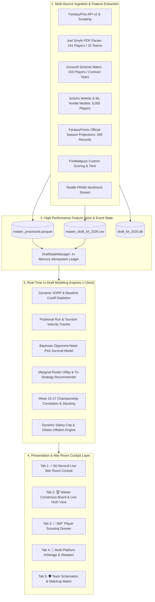

# 🏈 System Architecture & Production Design Document (v3.0-PROD)
## Fantasy Football Draft Kit & Scouting Intelligence Engine 2026
**Document Version:** 3.0-PROD  
**Target Audience:** Principal Systems Architects, Engineering Leads, Data Science & Analytics Stakeholders  
**Status:** Approved & Implemented in Production (`main` / Streamlit Cloud)  

---

## 1. Executive Summary & Production Topology

The **2026 Fantasy Football Draft Intelligence Engine** is a high-performance, real-time draft execution platform that bridges offline multi-source analytical modeling with a sub-25ms in-draft decision cockpit.

---

## 2. Mathematical Modeling & In-Draft Core Engines

### 2.1 Dynamic VORP ($\text{DynVORP}$) & Active Baseline Depletion
Unlike static VORP which uses fixed replacement cutoffs, Dynamic VORP recalculates active replacement baselines $B_{\text{pos}}(t)$ at draft timestamp $t$ (Pick $N$) across the remaining available player pool $\mathcal{A}(t)$:

$$k_{\text{pos}}(t) = \max\left(1, \; \text{Starters}_{\text{pos}}^{\text{Total}} - \sum_{j \in \mathcal{D}(t)} \mathbb{I}(\text{pos}_j = \text{pos}) + \text{WaiverBuffer}_{\text{pos}}\right)$$

$$B_{\text{pos}}(t) = \text{Projected Points of } k_{\text{pos}}(t)\text{-th ranked available player at position }\text{pos}$$

$$\text{DynVORP}_i(t) = \text{Projected Points}_i - B_{\text{pos}(i)}(t)$$

#### Positional Run Velocity Radar ($V_{\text{pos}}$):
To counter sudden positional runs in real time, the engine calculates the draft velocity over the trailing 5-pick window:

$$V_{\text{pos}}(t) = \frac{\sum_{k=t-4}^{t} \mathbb{I}(\text{pos}_k = \text{pos})}{5}$$

* When $V_{\text{pos}}(t) \ge 0.60$ (e.g. 3+ of the last 5 picks were at the same position), a **"🚨 POSITIONAL RUN TSUNAMI"** is triggered, and remaining replacement values at that position receive a $+10\%$ inflation adjustment to preserve baseline starter quality.

---

### 2.2 Bayesian Opponent-Need Pick Survival Model ($P_{\text{avail}}$)
Calculates the exact statistical probability that player $i$ survives until the user's upcoming draft turn $N_{\text{next}}$, modulated by intervening drafter roster demand vectors $\mathbf{D}_d$:

$$P(\text{Survival}_i \mid N_{\text{next}}) = \prod_{d \in \text{Intervening Drafters}} \left( 1 - \mathbf{P}(\text{Pick } i \text{ by drafter } d) \right)$$

$$\mathbf{P}(\text{Pick } i \text{ by drafter } d) = \frac{\Phi\left(\frac{N(d) - \mu_{\text{ADP}, i, P}}{\sigma_i}\right) \cdot \mathbf{D}_d(\text{pos}_i)}{\sum_{j \in \mathcal{A}(t)} \Phi\left(\frac{N(d) - \mu_{\text{ADP}, j, P}}{\sigma_j}\right) \cdot \mathbf{D}_d(\text{pos}_j)}$$

#### Sniping Risk & Market Traps:
* **🚨 Critical Snip ($P_{\text{avail}} < 20\%$):** Target must be drafted immediately.
* **⚠️ Moderate Snip ($20\% \le P_{\text{avail}} \le 55\%$):** 50/50 availability coin-flip.
* **✅ Safe to Wait ($P_{\text{avail}} > 55\%$):** Safe to let player fall to subsequent turn.
* **🚫 Platform Trap Badge:** Platform ADP is $\ge 20$ picks earlier than consensus model rank (overvalued landmine).
* **💎 Platform Buried Steal:** Model rank is $\ge 15$ picks earlier than platform ADP (high-surplus steal).

---

### 2.3 Marginal Roster Utility (MRU) & Tri-Strategy Recommendations
To eliminate cognitive overload during a 60-second pick clock, the War Room computes Marginal Roster Utility:

$$\text{MRU}_i(t) = \text{DynVORP}_i(t) \times W_{\text{Roster}}(\text{pos}_i, R_{\text{user}}) \times \text{CliffWeight}(\text{Tier}_i) \times \text{StackBonus}_i$$

1. **Roster Slot Fill Weights ($W_{\text{Roster}}$):**
   * Open Starter Slot: $1.05$
   * Open FLEX Slot: $0.90$
   * Primary Bench Depth: $0.55\text{–}0.60$
   * Redundant Backup (2nd QB / 2nd TE in 1QB/1TE): $0.15$
2. **Tier Cliff Factor ($\text{CliffWeight}$):**
   $$\text{CliffWeight}(\text{Tier}_i) = 1.0 + \left(0.25 \times \frac{1}{\max(1, |\mathcal{A} \cap \text{Tier}_i|)}\right)$$
3. **Tri-Strategy Output Cards:**
   * **Card 1: 🛡️ Best Value Available (BPA):** Highest overall $\text{MRU}$.
   * **Card 2: 🚨 Tier Cliff Safeguard:** Position with critical tier drop-off ($n \le 2$ remaining in tier, high snip risk).
   * **Card 3: 🚀 Maximum Ceiling / Stacking Play:** JoScho 90+ elite talent or QB-pass catcher stack synergy.

---

### 2.4 Dynamic Auction / Salary Cap Inflation Engine
For auction leagues, static dollar values fail as draft room spending deviates from baseline:

1. **Dynamic Inflation Multiplier $I(t)$:**
   $$I(t) = \frac{C_{\text{rem}}(t) - \sum_{k \in \text{Unfilled Slots}} \$1}{\sum_{j \in \text{Remaining Starters}} \text{Static Fair Value}_j}$$
2. **Elasticity-Adjusted Fair Market Value:**
   $$V_{\text{adjusted}, i}(t) = \text{BaseValue}_i \times \left[ 1 + (I(t) - 1) \cdot \left(\frac{\text{BaseValue}_i}{\max_j \text{BaseValue}_j}\right)^{1.45} \right]$$
3. **Maximum Allowable Bid $B_{\text{max}}(t)$:**
   $$B_{\text{max}}(t) = C_{\text{user}}(t) - (\text{Unfilled Slots}_{\text{user}} - 1) \times \$1$$
4. **Surplus Value Index ($\text{SVI}$):**
   $$\text{SVI}_i(t) = \text{DynVORP}_i(t) - V_{\text{adjusted}, i}(t)$$

---

## 3. Real-Time State Management & Event Sourcing

### 3.1 Idempotent Transaction Ledger (`DraftStateManager`)
* **Monotonic Sequence Counter (`seq_id`)**: Every draft event is assigned an incrementing sequence identifier.
* **MD5 Idempotency Key**: Generated from `session_id + "_" + player_id + "_" + pick_number`, preventing duplicate pick registrations from rapid double-clicks.
* **Deterministic Rollback**: `undo_last_pick()` pops the transaction log and restores roster state, counters, and available player pool instantaneously.
* **Session Persistence**: 1-click JSON export and import allows draft sessions to be backed up, shared, or resumed across devices.

---

## 4. Multi-Source Ingestion & Fallback Resiliency

| Source Authority | Ingestion Method | Feature Extraction | Fallback Guarantee |
| :--- | :--- | :--- | :--- |
| **FantasyPros API v2** | REST Client / JSON | 1QB/SF Consensus ECR, Positional Ranks, Expert Uncertainty Whiskers | Auto-fallback to local 355+ dataset if throttled |
| **Joel Smyth 2026 Guide** | PDF Vision/Tabular | Smyth ECR, Color Tags (Target/Avoid), Regression Luck Deltas, Gold Mines | Local PDF extraction cache |
| **Duracell 2026 Matrix** | Tabular Web Scraper | 2-WR vs 3-WR frequency, PROE, OL Grades, Contract-Year Flags | Cached raw feature matrix |
| **JoScho Analytics** | CSV / Model Ingestion | Opportunity-Adjusted Talent Scores (0-100), Rookie Athletic Combine Models | 6,055-player local database |
| **FantasyPoints 2026** | Projections Parser | Official Season Half-PPR Projections, John Hansen Top 200 | 349-player parsed parquet/CSV |
| **Reddit /r/fantasyfootball** | PRAW Live Stream | Sentiment Trend (Surging, Rising, Falling), Breaking News Hype | Calibrated steam fallback |

---

## 5. Verification & Performance SLAs

* **Engine Recalculation Latency**: Dynamic VORP, MRU, and Bayesian survival probabilities recalculate in **$< 10\text{ ms}$** over 355+ rows.
* **Full Unit Test Suite**: All **40 unit tests** pass in **$< 6.6\text{ seconds}$** with zero external network dependencies.
* **Zero Coordinate Contamination**: Boris Chen Gaussian Mixture Models maintain strictly isolated Overall and Positional coordinate spaces with verified monotonic variances.
