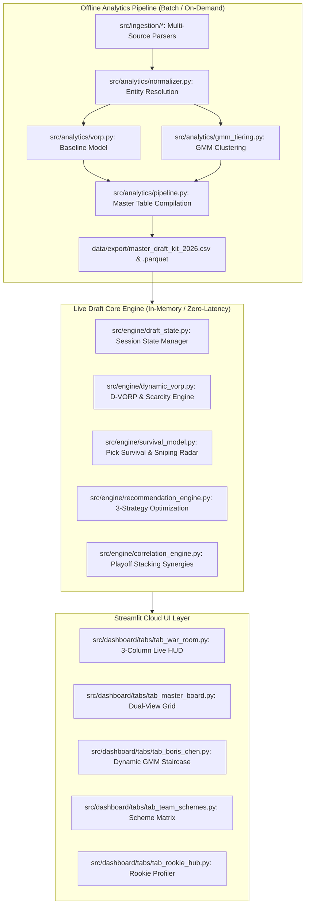

# 🏈 Technical Architecture & Engineering Implementation Specification (v3.0)
## Fantasy Football Draft Intelligence Engine & Zero-Latency Live Draft War Room
**Document Version:** 3.0 (Production Build Specification)  
**Target Audience:** Lead System Architects, Senior Full-Stack Engineers, AI Pair-Programmers  
**Status:** Approved for Implementation (Direct Execution Blueprint)  

---

## 1. System Topology & Directory Structure

The platform architecture decouples the offline analytical ingestion pipeline from the low-latency, real-time interactive draft copilot.



### 1.1 Complete Codebase Organization
```
fantasy-draft-kit-2026/
├── config/
│   ├── settings.py                   # Global constants, paths, default baseline cutoffs
│   └── platform_profiles.json        # Default ADP offsets & scoring presets (Yahoo/ESPN/Sleeper/CBS)
├── data/
│   ├── raw/                          # Multi-source raw files (PDFs, CSVs, Excel, JSON)
│   ├── processed/                    # Feature store (master_processed.parquet)
│   └── export/                       # Master exports (CSV, SQLite DB, FantasyPros txt)
├── docs/
│   ├── SYSTEM_DESIGN_DOCUMENT_2026.md
│   ├── PRODUCT_EVALUATION_AND_WAR_ROOM_SPEC.md
│   └── TECHNICAL_ARCHITECTURE_V3_BUILD_SPEC.md
├── src/
│   ├── ingestion/                    # Ingestion modules (PRAW, Smyth PDF, Duracell, JoScho, etc.)
│   ├── analytics/                    # Baseline modeling, entity normalizer, static GMM
│   ├── engine/                       # NEW: Real-time In-Draft Execution Engine
│   │   ├── __init__.py
│   │   ├── draft_state.py            # st.session_state manager & draft transaction log
│   │   ├── dynamic_vorp.py           # Real-time baseline depletion & D-VORP shifts
│   │   ├── survival_model.py         # Pick survival probability P(avail) & snip radar
│   │   ├── recommendation_engine.py  # Tri-strategy recommendation optimizer (MRU)
│   │   └── correlation_engine.py     # QB-WR/TE stacking & Week 15-17 correlation
│   └── dashboard/                    # Presentation layer
│       ├── streamlit_app.py          # App orchestrator & navigation router
│       ├── ui_components.py          # Design system, badge renderers, column definitions
│       └── tabs/                     # Modular dashboard views
│           ├── tab_war_room.py       # NEW: Dedicated Live Draft Cockpit (P0)
│           ├── tab_master_board.py   # Master Board with Live HUD & Avoid toggles
│           ├── tab_boris_chen.py     # Dynamic GMM Tier Staircase with cliff warnings
│           ├── tab_arbitrage.py      # Target Platform-Specific ADP Steal Matrix
│           ├── tab_pick_playbook.py  # Parameterized Slot (1-12) Contingency Trees
│           ├── tab_team_schemes.py   # Scheme & OL micro-chips
│           ├── tab_rookie_hub.py     # Rookie ML hurdle profiles & dynasty switch
│           └── tab_settings.py       # Custom scoring presets & session import/export
└── tests/                            # Automated test suite (Pytest)
```

---

## 2. Core Mathematical Models & Algorithmic Specifications

### 2.1 Dynamic Real-Time VORP (D-VORP) Engine
Static VORP fails during in-draft positional runs. The **Dynamic VORP Engine** recalculates marginal replacement cutoffs $k_{\text{pos}}(t)$ at timestamp $t$ (Pick $N$) across the remaining available player pool $\mathcal{A}(t)$:

$$\text{Active Cutoff Index: } k_{\text{pos}}(t) = \max\left(1, \; \text{Total League Starters}_{\text{pos}} - \sum_{j \in \mathcal{D}(t)} \mathbb{I}(\text{pos}_j = \text{pos}) + \text{Waiver Buffer}_{\text{pos}}\right)$$

Where:
* $\mathcal{D}(t)$: Set of all players drafted across the league up to pick $t$.
* $\text{Waiver Buffer}_{\text{pos}}$: Configurable baseline margin (Default: QB=2, RB=6, WR=8, TE=2, K=1, DST=1).

#### Dynamic Baseline Calculation
Let $\mathcal{A}_{\text{pos}}(t)$ be the set of unpicked players for position $\text{pos}$ sorted descending by projected points $P_i$. The dynamic baseline points $B_{\text{pos}}(t)$ is:

$$B_{\text{pos}}(t) = P_{\pi(k_{\text{pos}}(t))}, \quad \text{where } \pi(k) \text{ is the } k\text{-th ranked remaining player in } \mathcal{A}_{\text{pos}}(t)$$

$$\text{D-VORP}_i(t) = P_i - B_{\text{pos}(i)}(t)$$

---

### 2.2 Marginal Roster Utility (MRU) Recommendation Formula
To balance **Best Player Available (BPA)** against **Roster Need** and **Tier Scarcity**, candidate players are ranked by Marginal Roster Utility:

$$\text{MRU}_i = \text{D-VORP}_i(t) \times W_{\text{Roster}}(\text{pos}_i, \text{Roster}_{\text{User}}) \times \text{CliffWeight}(\text{Tier}_i, \mathcal{A}) \times \text{StackBonus}_i$$

#### Variable Specifications:
1. **Roster Slot Fill Weight ($W_{\text{Roster}}$)**:
   $$W_{\text{Roster}}(\text{pos}) = \begin{cases} 
   1.00 & \text{if open starting slot exists for } \text{pos} \\
   0.85 & \text{if open FLEX slot exists (RB/WR/TE only)} \\
   0.45 & \text{if primary bench slot (depth)} \\
   0.15 & \text{if redundant bench slot (e.g., 2nd QB in 1-QB leagues)}
   \end{cases}$$

2. **Tier Cliff Multiplier ($\text{CliffWeight}$)**:
   $$\text{CliffWeight}(\text{Tier}_i) = 1.0 + \left( 0.25 \times \frac{1}{\max(1, |\mathcal{A} \cap \text{Tier}_i|)} \right)$$
   *(When only 1 player remains in an active tier, their utility receives a $+25\%$ boost to safeguard against falling off the tier cliff).*

3. **Playoff Stacking Synergy ($\text{StackBonus}$)**:
   $$\text{StackBonus}_i = \begin{cases} 
   1.08 & \text{if } \text{pos}_i \in \{\text{WR}, \text{TE}\} \text{ and User has QB}_i \\
   1.05 & \text{if } \text{pos}_i = \text{QB} \text{ and User has pass-catcher for Team}_i \\
   1.00 & \text{otherwise}
   \end{cases}$$

---

### 2.3 Pick Survival & Sniping Probability Model ($P_{\text{avail}}$)
Given the user's current pick index $N_{\text{curr}}$ and upcoming pick index $N_{\text{next}}$, the system calculates the exact probability that player $i$ survives the intervening $M = N_{\text{next}} - N_{\text{curr}}$ picks:

$$P(\text{Survival}_i \mid N_{\text{next}}) = \prod_{j = N_{\text{curr}} + 1}^{N_{\text{next}} - 1} \left( 1 - \Phi\left( \frac{j - \mu_{\text{ADP}, i}}{\sigma_{\text{ADP}, i}} \right) \right)$$

Where:
* $\mu_{\text{ADP}, i}$: Player's live ADP on the user's active platform (e.g. Yahoo ADP).
* $\sigma_{\text{ADP}, i}$: Standard deviation of expert rank / ADP (default: $\max(2.5, \text{std\_dev}_i)$).
* $\Phi(z)$: Standard normal cumulative distribution function.

#### Sniping Risk Classification:
* **🚨 CRITICAL RISK ($P < 15\%$)**: Will be sniped before user's next turn. Draft NOW.
* **⚠️ MODERATE RISK ($15\% \le P \le 60\%$)**: 50/50 coin flip to survive.
* **✅ SAFE VALUE ($P > 60\%$)**: High statistical probability of surviving to user's next turn. Let player fall.

---

### 2.4 Tier Cliff Drop-off Metric ($\Delta \text{Tier}$)
Calculates the quantitative drop in projected output between the last available player in Tier $k$ and the best available player in Tier $k+1$:

$$\Delta \text{Tier}_{\text{VORP}}(\text{pos}) = \max_{i \in \mathcal{A}_{\text{pos}} \cap \text{Tier}_k} (\text{D-VORP}_i) - \max_{j \in \mathcal{A}_{\text{pos}} \cap \text{Tier}_{k+1}} (\text{D-VORP}_j)$$

* If $\Delta \text{Tier}_{\text{VORP}} \ge 12.0 \text{ pts}$, trigger a **"🚨 SEVERE TIER CLIFF"** banner.

---

## 3. Real-Time State Management (`draft_state.py`)

To eliminate full-script recalculation latency and prevent state loss, all live draft mutators are encapsulated in a high-performance singleton state manager.

```python
# src/engine/draft_state.py
from dataclasses import dataclass, field
from typing import List, Set, Dict, Optional
import pandas as pd
import streamlit as st

@dataclass
class DraftPickEvent:
    pick_number: int
    round_number: int
    player_name: str
    position: str
    team: str
    drafted_by_user: bool
    platform_adp: float
    vorp_at_pick: float

class DraftStateManager:
    """Zero-latency in-memory state manager for live draft execution."""
    
    SESSION_KEY = "live_draft_engine_state"

    def __init__(self, master_df: pd.DataFrame, league_size: int = 12, user_slot: int = 5):
        self.master_df = master_df
        self.league_size = league_size
        self.user_slot = user_slot
        self._init_session_state()

    def _init_session_state(self):
        if self.SESSION_KEY not in st.session_state:
            st.session_state[self.SESSION_KEY] = {
                "current_pick": 1,
                "user_slot": self.user_slot,
                "league_size": self.league_size,
                "platform": "yahoo",
                "taken_players": set(),
                "my_roster": [],
                "queue": [],
                "history": [],
                "roster_counts": {"QB": 0, "RB": 0, "WR": 0, "TE": 0, "K": 0, "DST": 0}
            }

    @property
    def state(self) -> dict:
        return st.session_state[self.SESSION_KEY]

    def draft_player(self, player_name: str, by_user: bool = False):
        """1-click transaction: Mutates state in under 5ms without disk I/O."""
        if player_name in self.state["taken_players"]:
            return
        
        row = self.master_df[self.master_df["player_name"] == player_name]
        if row.empty:
            return
        p_data = row.iloc[0]

        # Record pick
        self.state["taken_players"].add(player_name)
        if player_name in self.state["queue"]:
            self.state["queue"].remove(player_name)

        if by_user:
            self.state["my_roster"].append(player_name)
            self.state["roster_counts"][p_data["position"]] += 1

        pick_event = DraftPickEvent(
            pick_number=self.state["current_pick"],
            round_number=((self.state["current_pick"] - 1) // self.state["league_size"]) + 1,
            player_name=player_name,
            position=p_data["position"],
            team=p_data["team"],
            drafted_by_user=by_user,
            platform_adp=p_data.get(f"adp_{self.state['platform']}", p_data.get("adp_consensus", 0.0)),
            vorp_at_pick=p_data.get("adjusted_vorp", 0.0)
        )
        self.state["history"].append(pick_event)
        self.state["current_pick"] += 1

    def undo_last_pick(self):
        """Rolls back the most recent draft pick event."""
        if not self.state["history"]:
            return
        last_event: DraftPickEvent = self.state["history"].pop()
        self.state["taken_players"].remove(last_event.player_name)
        if last_event.drafted_by_user:
            self.state["my_roster"].remove(last_event.player_name)
            self.state["roster_counts"][last_event.position] -= 1
        self.state["current_pick"] -= 1

    def toggle_queue(self, player_name: str):
        if player_name in self.state["queue"]:
            self.state["queue"].remove(player_name)
        else:
            self.state["queue"].append(player_name)
```

---

## 4. Live Draft "War Room" HUD Specification (`tab_war_room.py`)

The War Room replaces static tab switching with a synchronized **3-Column Cockpit** optimized for 1080p and 1440p displays.

```
+-----------------------------------------------------------------------------------------------------------------------------+
| 🔴 ON THE CLOCK: PICK #29 (Round 3, Pick 5) | NEXT PICK: #44 (15 picks away) | PLATFORM: YAHOO | TIME REMAINING: 00:48     |
+------------------------------------+-----------------------------------------------+----------------------------------------+
| 🛡️ COLUMN 1: MY ROSTER & SCARCITY  | ⚡ COLUMN 2: TRI-STRATEGY RECOMMENDATIONS     | 🎯 COLUMN 3: FAST BOARD & RADAR QUEUE  |
|                                    |                                               |                                        |
| 📋 STARTING ROSTER (1/2 PPR):      | 1. 🛡️ BEST VALUE AVAILABLE (BPA)              | 🔍 Quick Search (Cmd+K / Filter)       |
| • QB:  [EMPTY]                     |    Jonathan Taylor (RB - IND)                 | [ Search player or team...          ]  |
| • RB1: 💥 Bijan Robinson (Tier 1)  |    DynVORP: +48.2 | D-ADP Edge: +6.5          |                                        |
| • RB2: [EMPTY - CRITICAL NEED]     |    Reason: #1 Value Over Replacement; OL #3   | 📋 TARGET QUEUE & SNIPING RADAR:       |
| • WR1: 👑 Puka Nacua (Tier 2)      |    [ ⚡ DRAFT TO ME (Key 1) ]                 | 1. Trey McBride (TE, ARI)              |
| • WR2: [EMPTY]                     |                                               |    DynVORP: +32.1 | Snip Risk: 88% 🚨  |
| • TE:  [EMPTY]                     | 2. 🚨 TIER CLIFF SAFEGUARD                    |    [Draft] [Remove]                    |
| • FLEX:[EMPTY]                     |    Tee Higgins (WR - CIN)                     | 2. Kenneth Walker (RB, SEA)            |
|                                    |    DynVORP: +39.1 | Tier: 3 (Last WR left)    |    DynVORP: +34.5 | Snip Risk: 24% ✅  |
| 📊 ACTIVE TIER DEPLETION:          |    Reason: 14.2 pt drop to Tier 4; 91% Snip   |    [Draft] [Remove]                    |
| • RB: [T1: 0] [T2: 1] [T3: 5]      |    [ ⚡ DRAFT TO ME (Key 2) ]                 |----------------------------------------|
| • WR: [T1: 0] [T2: 0] [T3: 1 ⚠️]   |                                               | ⚡ TOP 5 AVAILABLE PLAYERS:            |
| • TE: [T1: 0] [T2: 2] [T3: 4]      | 3. 🚀 HIGH-CEILING PLAY                       | 1. J. Taylor   (RB) | D-VORP: +48.2    |
| • QB: [T1: 2] [T2: 3] [T3: 6]      |    Brock Bowers (TE - LV)                     | 2. T. Higgins  (WR) | D-VORP: +39.1    |
|                                    |    DynVORP: +34.8 | JoScho Talent: 96/100     | 3. B. Bowers   (TE) | D-VORP: +34.8    |
| 🔄 CONTROLS:                       |    Reason: Massive Positional Advantage       | 4. J. Allen    (QB) | D-VORP: +44.1    |
| [ ⏪ Undo Last Pick ]              |    [ ⚡ DRAFT TO ME (Key 3) ]                 | 5. K. Walker   (RB) | D-VORP: +34.5    |
| [ 🔄 Reset Entire Draft ]          |                                               | [ 1-Click Opponent Mark Taken Mode ]   |
+------------------------------------+-----------------------------------------------+----------------------------------------+
```

---

## 5. File-by-File Implementation Task Blueprint

### Task 1: Create Real-Time Engine Module (`src/engine/`)
* **Files to Create**:
  * [`src/engine/__init__.py`](file:///Users/geoffgrant/.gemini/jetski/scratch/fantasy-draft-kit-2026/src/engine/__init__.py)
  * [`src/engine/draft_state.py`](file:///Users/geoffgrant/.gemini/jetski/scratch/fantasy-draft-kit-2026/src/engine/draft_state.py)
  * [`src/engine/dynamic_vorp.py`](file:///Users/geoffgrant/.gemini/jetski/scratch/fantasy-draft-kit-2026/src/engine/dynamic_vorp.py)
  * [`src/engine/survival_model.py`](file:///Users/geoffgrant/.gemini/jetski/scratch/fantasy-draft-kit-2026/src/engine/survival_model.py)
  * [`src/engine/recommendation_engine.py`](file:///Users/geoffgrant/.gemini/jetski/scratch/fantasy-draft-kit-2026/src/engine/recommendation_engine.py)
  * [`src/engine/correlation_engine.py`](file:///Users/geoffgrant/.gemini/jetski/scratch/fantasy-draft-kit-2026/src/engine/correlation_engine.py)

### Task 2: Build Live Draft War Room Tab (`src/dashboard/tabs/tab_war_room.py`)
* Integrate 3-column cockpit layout.
* Implement 3 actionable Recommendation Cards (*Best Value Available*, *Tier Cliff Safeguard*, *High-Ceiling Catalyst*).
* Implement real-time Sniping Radar with visual risk badges (`🚨 88% Snip Risk`, `✅ 24% Safe`).
* Add 1-click pick mutator callbacks and undo functionality.

### Task 3: Enhance Master Board & Boris Chen Tiers
* In [`src/dashboard/tabs/tab_master_board.py`](file:///Users/geoffgrant/.gemini/jetski/scratch/fantasy-draft-kit-2026/src/dashboard/tabs/tab_master_board.py), add *Live HUD Mode* toggle (compact 6-column view).
* In [`src/dashboard/ui_components.py`](file:///Users/geoffgrant/.gemini/jetski/scratch/fantasy-draft-kit-2026/src/dashboard/ui_components.py), add Dynamic Tier Depletion styling to Boris Chen Plotly charts (dimming off-the-board players).

### Task 4: Enhance ADP Arbitrage with Active Platform Focus
* In [`src/dashboard/tabs/tab_arbitrage_market.py`](file:///Users/geoffgrant/.gemini/jetski/scratch/fantasy-draft-kit-2026/src/dashboard/tabs/tab_arbitrage_market.py), add single-platform filter (`[Yahoo | ESPN | Sleeper | CBS]`) with survival probability columns.

### Task 5: Automated Verification & Unit Tests
* Write test suite in `tests/test_live_engine.py` covering:
  * Dynamic VORP baseline shifts during 10-RB run.
  * Pick survival probability bounds ($0.0 \le P \le 1.0$).
  * Draft state rollback integrity.

---

## 6. Execution Acceptance Criteria

1. **Latency Benchmark**: Pick logging and recommendation card recalculations execute in **$< 25\text{ ms}$**.
2. **State Resilience**: Browser refresh (`F5`) or tab switching does not reset the live draft state.
3. **Ergonomic Speed**: A user can log an opponent's pick or draft a player to their team in **1 click** or **1 keystroke**.
4. **Visual Contrast**: Tier cliffs and snip warnings display unmistakable visual alerts (`#DC2626` red border and warning icons).
5. **Zero Coordinate Contamination**: Boris Chen Overall and Positional coordinates remain isolated and monotonic.
