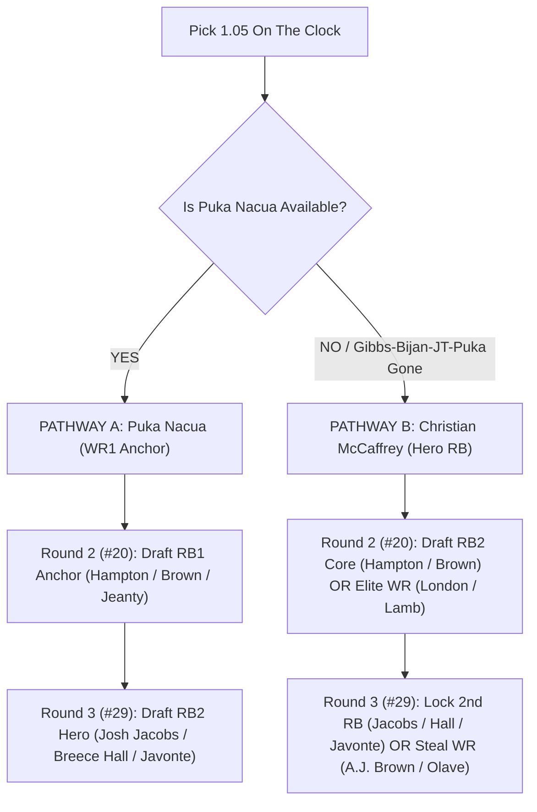

# 🏈 2026 Master Draft Playbook: Pick 1.05 Strategy Guide

**League Setup**: 12-Team | 1/2 PPR | 1 QB, 2 RB, 2 WR, 1 TE, 1 FLEX, 1 K, 1 DST, 6 Bench  
**Draft Position**: **Pick 1.05** (Snake: Pick #5, #20, #29, #44, #53, #68, #77, #92, #101, #116, #125, #140, #149, #164)

---

## 🎯 Executive Blueprint
1. **Core Priority (Rounds 1–3)**: Secure **at least 2 Top-15 RBs** while locking in an elite WR anchor.
2. **Positional Advantage (Rounds 4–6)**: Hammer high-target-funnel WRs and Exodia league-winners in the mid-round flex zone.
3. **Punt QB & TE (Rounds 7–9)**: Exploit late-round efficiency models to draft top-10 offense dual-threat QBs and high-route-participation TEs at zero draft capital penalty.
4. **Zero K/DST Stash Strategy (Rounds 10–14)**: Skip Kicker and DST during the draft to hoard **two extra high-ceiling RB/WR lottery tickets** before Week 1 kickoff.

---

## 🧭 Branching Decision Tree: Round 1 (Pick 1.05 / #5 Overall)

---

## ⚔️ PATHWAY A: The "Puka Nacua Anchor" (WR ➔ RB ➔ RB)
*Use this path if Puka Nacua is available at 1.05.*

| Round | Pick # | Target Player | Pos | Yahoo ADP | Tactical Edge & Strategy |
| :--- | :--- | :--- | :--- | :--- | :--- |
| **1** | **#5** | **Puka Nacua** | WR | 4.8 | ⭐ **Top-10 Eco (McVay)** • 🛡️ Top-5 OL • 🟢 Green Schedule (≤2 Shadow CBs) • 💰 Contract Year. Elite WR1 floor/ceiling combo. |
| **2** | **#20** | **Omarion Hampton** / **Chase Brown** / **Ashton Jeanty** | RB | 18.7 / 16.4 / 14.4 | 💥 **Exodia Must-Have Core**. Secure your true 3-down bellcow. Hampton (McDaniel run scheme) or Chase Brown (Bengals workhorse) carry Top-5 RB ceiling. |
| **3** | **#29** | **Josh Jacobs** / **Breece Hall** / **Javonte Williams** | RB | 33.4 / 35.4 / 34.6 | 👑 **The 2-RB Lock**. Jacobs (LaFleur 67% GL run share) and Breece Hall fall past pick 30 on Yahoo! Javonte Williams ("The Twelve") provides bellcow safety. |
| **4** | **#44** | **Tyler Warren** / **Rhamondre Stevenson** / **Garrett Wilson** | FLEX | 47.2 / 80.1 / 49.4 | 🎯 Best player available. Warren (TE1 alpha) or Rhamondre (McDaniels lead back) or Garrett Wilson (Frank Reich slot funnel). |
| **5** | **#53** | **Jaylen Waddle** / **Luther Burden** / **Christian Watson** | WR | 41.9 / 58.8 / 67.7 | 💥 **Exodia WR Upside**. Waddle (Payton #1 OL) or Burden (Ben Johnson scheme) provide dynamic WR2 firepower. |
| **6** | **#68** | **Sam LaPorta** / **Quentin Johnston** / **Harold Fannin** | FLEX | 63.1 / 109.7 / 71.4 | 🟣 **Yahoo Steal Zone**. Q. Johnston (Yahoo ADP 109 $\to$ +22 pick steal!) or LaPorta (Lions top eco) if TE falls. |

---

## 🛡️ PATHWAY B: The "CMC Hero RB" (RB ➔ RB/WR ➔ RB/WR)
*Use this path if Puka Nacua, Gibbs, and Bijan are gone and you take CMC.*

| Round | Pick # | Target Player | Pos | Yahoo ADP | Tactical Edge & Strategy |
| :--- | :--- | :--- | :--- | :--- | :--- |
| **1** | **#5** | **Christian McCaffrey** | RB | 5.6 | ⚠️ **Dirty 30 High-Ceiling Pick**. Shanahan #6 OL • 24.8 Adj PPG baseline. Must be paired with a durable, high-volume RB in R2 or R3. |
| **2** | **#20** | **Chase Brown** / **Omarion Hampton** OR **Drake London** | RB/WR | 16.4 / 18.7 / 19.1 | **Fork in the Road**: If you want your 2 RBs immediately, take Chase Brown/Hampton. If you want WR1 insurance, take Drake London (Stefanski WR1). |
| **3** | **#29** | **Josh Jacobs** / **Breece Hall** OR **A.J. Brown** / **Chris Olave** | RB/WR | 33.4 / 35.4 / 24.7 / 32.9 | **Execute the 2-RB Guarantee**: If you took London in R2, draft Jacobs/Breece here. If you took RB in R2, draft A.J. Brown (Yahoo Steal +11) or Olave (+9). |
| **4** | **#44** | **Jameson Williams** / **Terry McLaurin** / **Tyler Warren** | WR/TE | 65.9 / 54.0 / 47.2 | 🟣 Jameson Williams (+13 picks later on Yahoo) or McLaurin ("The Twelve") gives explosive perimeter production. |
| **5** | **#53** | **Christian Watson** / **Parker Washington** / **Bhayshul Tuten** | WR/RB | 67.7 / 82.1 / 62.5 | 💥 Watson (Matt LaFleur eco) or Parker Washington (+16 pick steal in Liam Coen offense). |
| **6** | **#68** | **DJ Moore** / **Brian Thomas Jr.** / **Tucker Kraft** | WR/TE | 62.0 / 83.9 / 60.8 | ⭐ Top-10 Eco Value. Brian Thomas (Yahoo ADP 84) is a massive value in round 6. |

---

## 🎯 Punting QB & TE Blueprint (Rounds 7–9)

By letting your league-mates overpay for early QBs (Burrow, Allen, Mahomes) and TEs (McBride, Kelce), you capture massive positional efficiency here:

### ⚡ Target QBs (Rounds 7–9 / Picks #77, #92, #101)
1. **Trevor Lawrence (JAC - Round 7 / Pick #77)**:
   * **Guru & Smyth Rating**: 👑 **"The Twelve" Breakout Pick**.
   * **Catalyst**: Liam Coen pass-heavy offense + rushing floor + OL upgrade. Yahoo ADP is 84.8 (Major steal).
2. **Justin Herbert (LAC - Round 7 / Pick #77)**:
   * **Guru Rating**: 👑 **"The Twelve" Core Target**. Mike McDaniel offense + Top-10 weapons.
3. **Brock Purdy (SF - Round 8 / Pick #92)**:
   * **Target**: 🎯 **Smash Target**. Kyle Shanahan #6 OL. *Ideal stack if you drafted CMC in Round 1!*
4. **Caleb Williams (CHI - Round 8 / Pick #92)**:
   * **Target**: Ben Johnson pass-funnel offense + Top-5 OL (#4).
5. **Jaxson Dart (NYG - Round 9 / Pick #101)**:
   * **Target**: 🔥 **Breakout Catalyst**. Matt Nagy rushing QB cheat code with dual-threat 30+ rushing yards/game floor.

### 🧤 Target TEs (Rounds 7–9 / Picks #77, #92, #101)
1. **Tucker Kraft (GB - Round 7 / Pick #72 / ADP 60.8)**:
   * **Rating**: 💥 **Exodia TE1 Alpha**. Matt LaFleur top target in contract year.
2. **Mark Andrews (BAL - Round 8 / Pick #78 / ADP 113.4)**:
   * **Rating**: 🔥 **Massive Yahoo Value Steal**. Baltimore's primary red-zone receiver drafted 35 picks too late on Yahoo.
3. **Dallas Goedert (PHI - Round 8 / Pick #84 / ADP 106.3)**:
   * **Rating**: 🎯 **Smash Target**. Sean Mannion #2 OL • high target consolidation.
4. **Dalton Kincaid (BUF - Round 8 / Pick #95 / ADP 99.0)**:
   * **Rating**: 🎯 **Smash Target**. Joe Brady #1 pass-catcher in contract year.
5. **Juwan Johnson (NO - Round 9 / Pick #92 / ADP 127.4)**:
   * **Rating**: Kellen Moore starting TE, free in round 9-10.

---

## 🎰 Zero K/DST Strategy: Rounds 10–14 High-Upside Fliers

> [!TIP]
> **Why Skip Kicker & DST in the Draft?**
> Fantasy kickers and defenses are highly replaceable streamers in Week 1. By drafting **two extra high-upside skill players** in rounds 13 and 14, you hold lottery tickets through preseason cuts and depth chart battles. You can simply drop your lowest-performing bench stash for a streamer 10 minutes before kickoff on Week 1 Sunday!

### 📋 Priority Fliers by Round:

#### 🔹 Round 10 (Pick #116 / ADP 115–125)
* **Jayden Reed (WR, GB - ADP 119.2)**: 🟣 **Yahoo Steal (+12 picks)**. Matt LaFleur slot weapon with manufactured touches.
* **Matthew Golden (WR, GB - ADP 128.1)**: ⭐ **Top-10 Eco Value**. High-upside rookie with explosive perimeter metrics.
* **Xavier Worthy (WR, KC - ADP 128.9)**: Andy Reid vertical lid-lifter with week-winning ceiling.

#### 🔹 Round 11 (Pick #125 / ADP 125–135)
* **Jonathon Brooks (RB, CAR - ADP 97.2)**: 💥 **Exodia Stash**. Workhorse profile recovering from injury; if he takes the job, he is an instant RB2.
* **Blake Corum (RB, LAR - ADP 99.6)**: ⭐ **Top-10 Eco Handcuff & GL Back**. Sean McVay goal-line vulture with standalone flex value and top-5 upside if Kyren misses time.
* **Kyle Monangai (RB, CHI - ADP 104.3)**: Ben Johnson interior grinder behind a top-5 offensive line.
* **RJ Harvey (RB, DEN - ADP 103.9)**: Sean Payton pass-catching satellite back in a high-volume screen game.

#### 🔹 Round 12 (Pick #140 / ADP 135–150)
* **Tre Tucker (WR, LV - ADP 199.0)**: 🟣 **Massive Yahoo Steal (+38 picks later on Yahoo)**. Explosive field stretcher.
* **Cooper Kupp (WR, SEA - ADP 250.5)**: 🟣 **Yahoo Steal (+35 picks later)**. Experienced volume earner in condensed sets.
* **Jalen Nailor (WR, LV - ADP 195.4)**: 🟣 **Yahoo Steal (+20 picks later)**. Klint Kubiak zone-beater.

#### 🔹 Round 13 (Pick #149 — Extra Skill Stash Instead of Kicker)
* **Audric Estime / Dylan Sampson (RB, DEN/CLE - ADP 145+)**: Pure goal-line touchdown anchors.
* **Malik Willis (QB, MIA - ADP 124.8)**: 💥 **Exodia Dual-Threat Rushing Stash**. If Tua is limited, Willis offers 50+ rush yards per start.

#### 🔹 Round 14 (Pick #164 — Extra Skill Stash Instead of DST)
* **Pat Freiermuth (TE, PIT - ADP 259.1)**: 🟣 **Yahoo Steal (+60 picks later)**. Arthur Smith multi-TE red-zone target.
* **Cade Otton (TE, TB - ADP 219.7)**: 🟣 **Yahoo Steal (+22 picks later)**. 90%+ snap rate every-down tight end.

---

## 🏆 Summary Checklist for Draft Day

- [ ] **1.05**: Draft **Puka Nacua** (if available) or **Christian McCaffrey**.
- [ ] **2.08**: Draft **Omarion Hampton** or **Chase Brown** (RB1 Lock).
- [ ] **3.05**: Draft **Josh Jacobs**, **Breece Hall**, or **Javonte Williams** (2-RB Requirement Met!).
- [ ] **4.08 / 5.05 / 6.08**: Load up on **Exodia WRs** (Waddle, Burden, Watson, Q. Johnston).
- [ ] **7.05 / 8.08**: Draft **Trevor Lawrence / Justin Herbert** (QB) and **Tucker Kraft / Mark Andrews** (TE).
- [ ] **9.05–14.08**: Hoard high-upside RBs (**Blake Corum, Jonathon Brooks, Kyle Monangai**) and WR steals (**Jayden Reed, Tre Tucker**), ignoring K/DST until Week 1!
